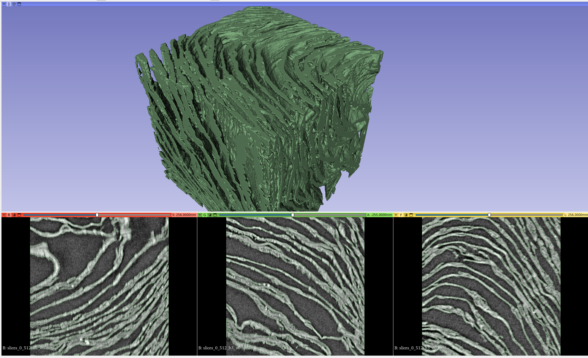
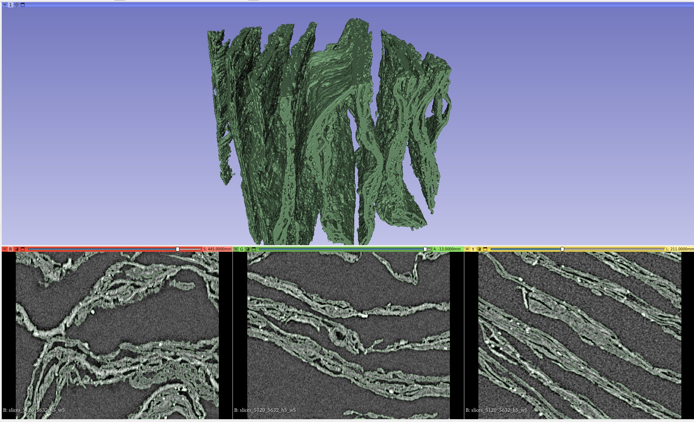
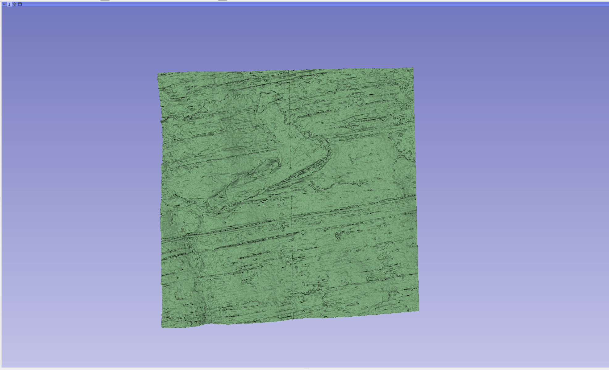
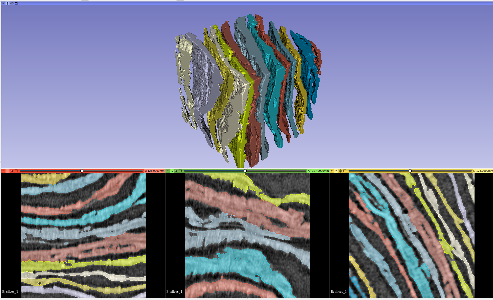
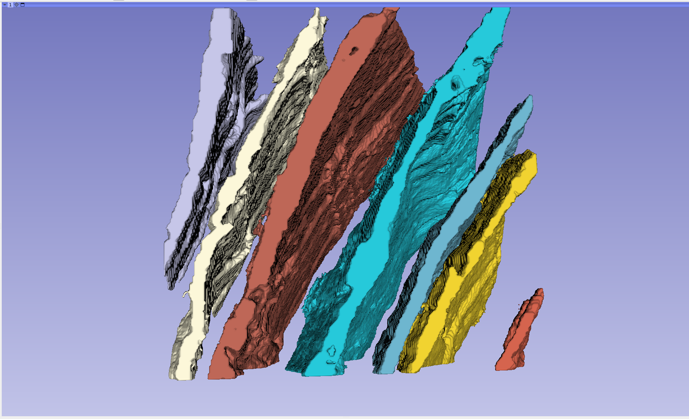
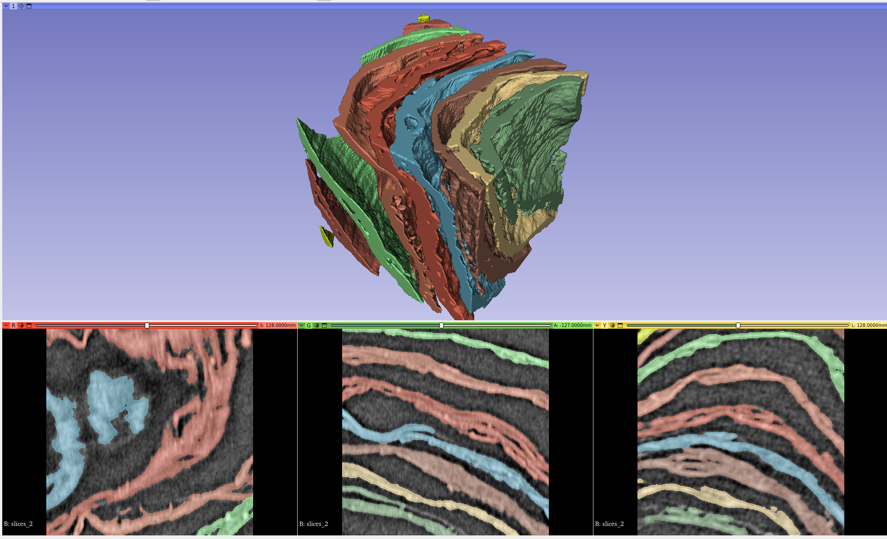
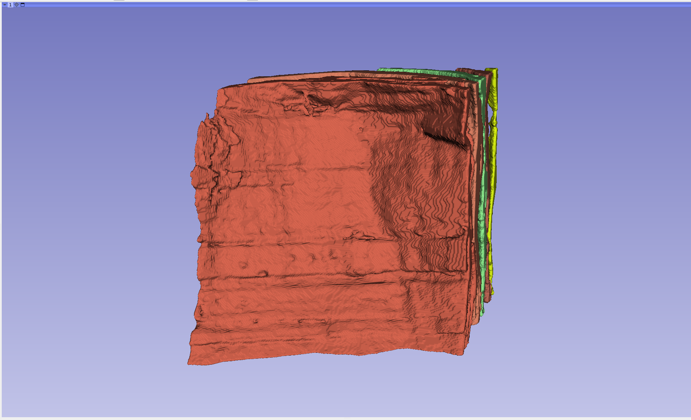
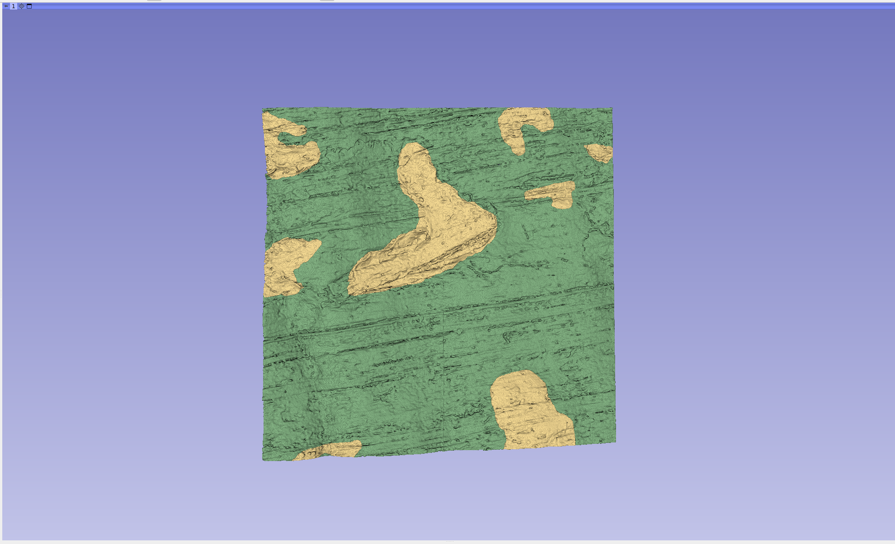

## March 2024 Progress Prize Submission

This submission is aiming to contribute foundational work for 3D based segmentation of scrolls, and take advantage 
of networks that can see in 3D.

Contents:
- Trained network weights with inference notebook for air-papyrus segmentation in 3D
- 2x volumes of ground truth layers for analysis or bootstrap for 3D based layer separation methods

## Air-Papyrus 3D Segmentation Network

The notebook contains code to infer raw volumetric data from the scrolls or fragments to extract the shape of the papyrus.

The network is a fairly standard 3D UNET, slightly adapted from Monai's implementation to allow setting kernel sizes/strides 
per layer. Requires ~5GB of Vram on a 512 cube input volume. Weights had unsupervised pretraining on volumes from scroll 1,
and fragments 1, 3 and 4, then supervised training on scroll 1 volumes using ground truth papyrus masks from 2D approaches.

Limitations: It will also segment out the scroll casing as well as areas of high noise in the fragment scans. 
I've found in practise they can usually be removed or ignored very easily, so I haven't had the need to refine 
this network further.

Further note: This network is overkill for the task; A much smaller network could be used, however I was 
leaving the option to use this network design/weights as a basis for more complex training tasks.

Data input: 3D volume with dimensions divisible by the kernels (256, 320, 384 ... 512) eg 512x512x512 as float32 data type.
Outputs: 3D binary mask of same shape where 0 is air and 1 is papyrus in uint8 data type.

Here are example outputs and what it looks like when visualised in 3D:

**Scroll 1 (512 cube - slices 00000-00512 at pixels 2408-2920, 4560-5072):**

**Scroll 4 (512 cube - slices 05120-05632 at pixels 2906-3418, 3036-3548):**

**Fragment 1 (4x512 cubes - slices 1024-2048 at width: 1149-2173):** (Note visible tick feature)

## Applications of network:

### Layer segmentation:

I spent a lot of time using this network to investigate 3D regions of scroll 1 and the fragments. 
One of the main features visible in 3D is the shape and flow of each layer's papyrus weave/lattice, 
and I believe this can be a strong signal for a 3D network to use to separate layers. 
As a proof of concept, I used this papyrus segmentation and 3D visualisations as a guide to 
manually separate the layers using Slicer. So far this has resulted in two 256 cubes of 10+ layers, 
which are included in this submission. 

**Layers_1: 13 discrete layers segmented using 3D papyrus mask as starting point**

**Same volume with some layers set to invisible**

**Layers_2: 10 discrete layers - these layers unsegmented can be seen in the example segmentation for scroll 1,
the top rightmost section**

**Layers_2: Example of what a layer looks like front on**

I am using these pieces of data as an initial ground truth dataset to experiment with various approaches for automatic 3D layer 
segmentation. My belief from manually separating the layers is that the hard regions of the scrolls will impossible 
to segment/verify using 2D based approaches, but 3D approaches might succeed due to networks seeing contrasting papyrus 
lattices with full context. 

### Volumetric Ink Segmentation:

**Fragment 1 section from above with the ground truth ink labels from the 2023 Grand Prize data baked in. 
Note the visible tick in the 3D reconstruction corresponds to ink when aligned**

A second application I have some early work on from the 2023 Grand Prize is using the segmentation as an anchor for ink 
segmentation native to the scan, bypassing the flattening process. I feel in theory the ink signal should be easier to read
when the network also has the signal of papyrus shape and surface impressions. To make progress towards this, I manually aligned the ground truth ink label masks
supplied with the fragment data to the fragment scans. This allowed me to extract out the top layer from the fragments and 
compare the scan voxels in the ink regions with the rest of the scan voxels making up the top layer. The end result was 
training networks to segment the ink regions in the layers directly from the scan rather than flattened data. I feel if enough pages like the above can
be used to bootstrap a network, it could even be possible to detect the ink without needing any segmentation priors

I can share more of my work (eg the aligned ink labels or the initial training runs) on 3D ink segmentation, however 
given the success of other methods for ink detection I have parked this in favour of working on 3D layer separation.

### Extra details

All 3D visualisations and work with 3D data was done using [Slicer](https://www.slicer.org/)

All files for data shown in the above can be shared if desired (and allowed under the data sharing rules of the project)

Contact me at tim.skinner@protonmail.com